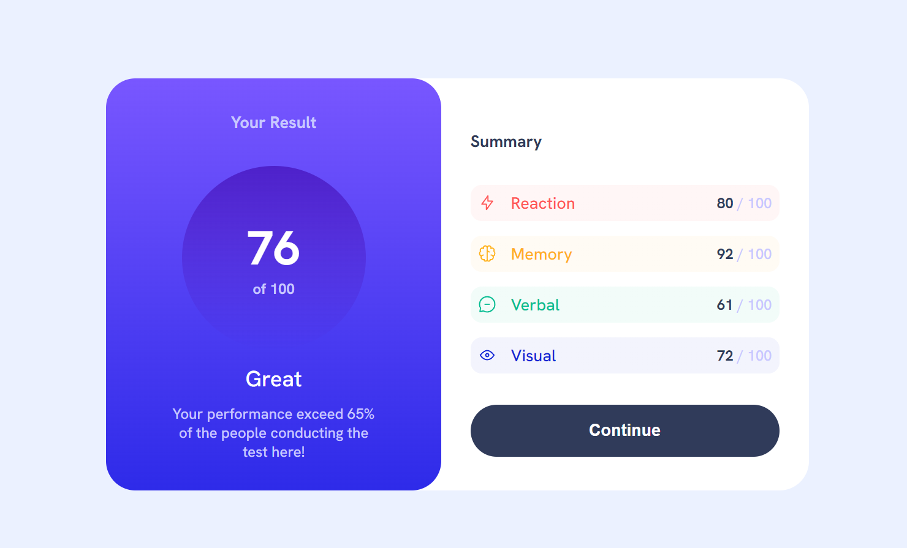
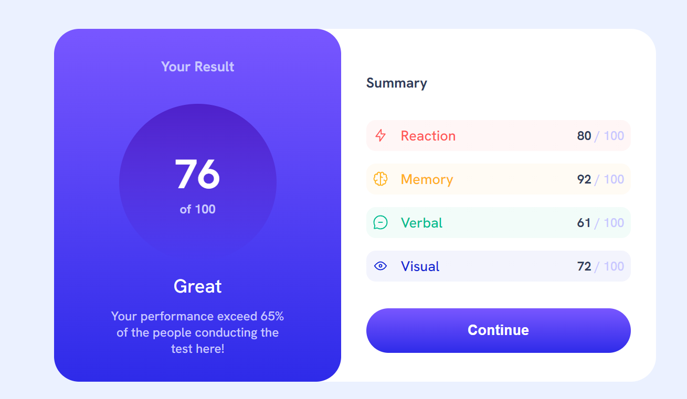
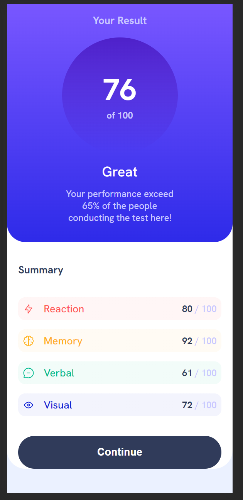
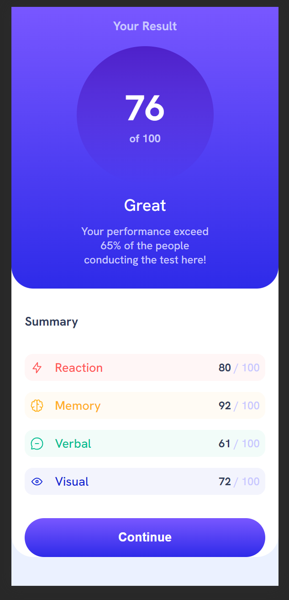

# Introduction

68 65 6c 6c 6f 20 66 72 69 65 6e 64, I'm Szeri, an aspiring Full Stack developer. I am improving my frontend and design skills.

# Frontend Mentor - Results summary component solution

This is a solution to the [Results summary component challenge on Frontend Mentor](https://www.frontendmentor.io/challenges/results-summary-component-CE_K6s0maV). Frontend Mentor challenges help you improve your coding skills by building realistic projects. 

## Table of contents

- [Introduction](#introduction)
- [Overview](#overview)
  - [The challenge](#the-challenge)
  - [Screenshot](#screenshot)
  - [Links](#links)
- [My process](#my-process)
  - [Built with](#built-with)
  - [What I learned](#what-i-learned)
  - [Continued development](#continued-development)
- [Author](#author)

## Overview

### The challenge

Users should be able to:

- View the optimal layout for the interface depending on their device's screen size
- See hover and focus states for all interactive elements on the page
- **Bonus**: Use the local JSON data to dynamically populate the content

### Screenshot

### Links

- Solution URL: [Frontend Mentor solution](https://www.frontendmentor.io/solutions/sassscss-mobilefirst-rwd-result-summary-component-sRBeLm4iA1)
- Live Site URL: [My site live URL](https://centerdiv.pl/projects/others/frontendmentor/ResultSummaryComponent/result-summary-component.html)
- Live Site URL: [Github live URL](https://szeri323.github.io/projects/others/frontendmentor/ResultSummaryComponent/result-summary-component.htmlm)

## My process

### Built with

- HTML5
- Sass/Scss
- Flexbox
- CSS Grid
- Mobile-first workflow
- Javascript Vanilla
- Json file

### What I learned

It was a great exercise,

this simple project made me think about breaking down the HTML structure to keep it simple and be able to precisely reference and modify elements.

The second thing is the correct naming of elements, whether to name the classes of elements according to the BEM methodology, whether to call the container a card or a box, or perhaps to name the element according to its use or purpose.

I added java script json file handler processing 4 different scores (beacuse of css styles). 

### Continued development

The main problem I encountered was with the class name, which acts as a specifier. The element is assigned two classes: 'score' and 'one, two', among others. The 'score' class applies a uniform style to all elements, whereas the 'one' class assigns a specific style, such as a different background and font color. When I implemented the JSON solution, I realized that my function relies on integer values, whereas my classes require string values. Consequently, I had to create a dictionary that converts integer values into corresponding string representations for the class names.

## Author

- Website - [Szeri centerdiv.pl](https://centerdiv.pl)
- Frontend Mentor - [@Szeri323](https://www.frontendmentor.io/profile/Szeri323)

